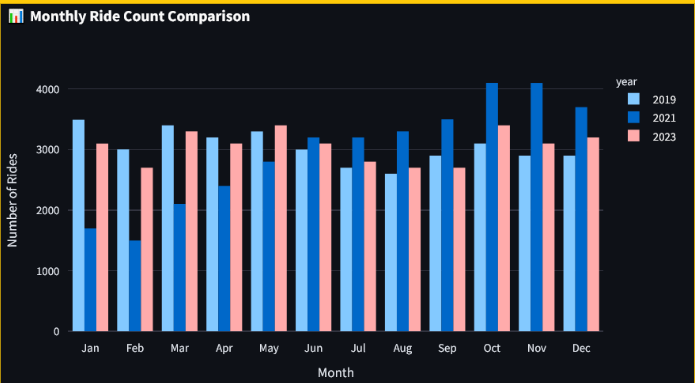
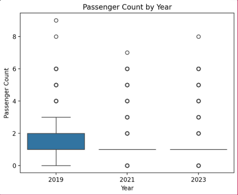
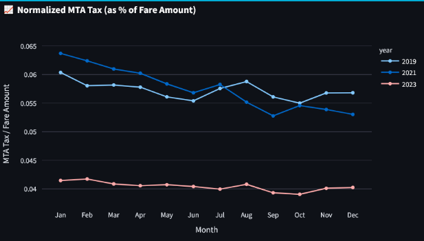
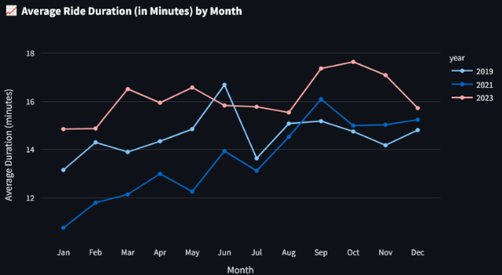

# DAEN328_Project_MJMH
Project repository for our DAEN 328 term project

# Project Overview
This project utilizes the New York City Yellow Taxi Trip Records API provided by the NYC govenment.We extracted, transformed, and loaded this data onto streamlit in order to visualize analytics and insights

## PowerPoint details
  https://docs.google.com/presentation/d/1DLFPIBSmvK7MP0EPkQDult-LOsno_jCv5Fr5s5GwPH4/edit?usp=sharing

## Description of each feature
  https://www.nyc.gov/assets/tlc/downloads/pdf/data_dictionary_trip_records_yellow.pdf

## API Used
This project utilizes the **New York City Yellow Taxi Trip Records API** provided by the [NYC Open Data Portal](https://data.cityofnewyork.us/). 

# How to RUN

Download the Test_Run folder via your preferred method.  
Open a command prompt or appropriate terminal and change directory to the downloaded folder.  
With Docker desktop running, run:

docker-compose up --build
# 
access by going to http://localhost:8501

# Streamlit visualizations

#

#

#

  
# Members
Jameson Adams - exporting data, streamlit, data visualization
#
Henry Supp - transforming data, data visualization
#
George Mathew - transforming data, data visualization
#
Michael Ybarra - Docker, data visualization

